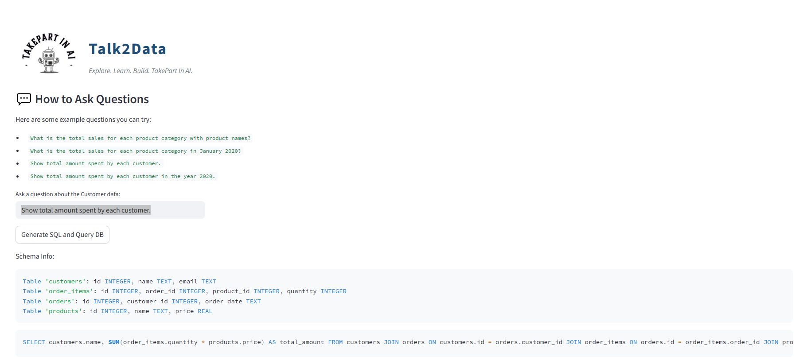
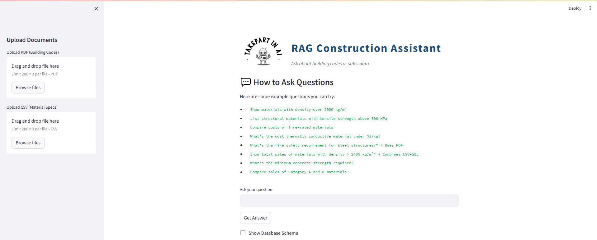

##  GenAI-Powered Text-to-SQL Application
## Overview
This project enables users to interact with databases using natural language queries. 

## Key Features
- Natural Language Interface: Users can input plain English questions.
- SQL Generation: Converts natural language queries into SQL using Groq's LLM.
- SQL Validation: Ensures generated SQL is valid before execution.
- Token Usage Tracking (NOT WORKING): Monitors token usage per query for cost and performance insights.
- Real-Time Execution: Executes validated SQL queries on the connected database.
- Dynamic Schema Awareness: Adapts to the database schema for accurate query generation.
- Multi-source RAG:
    - PDFs processed with FAISS vector search
    - CSVs loaded into SQL database
    - Original sales data maintained
- Intelligent Query Routing:
    - Uses Zero-shot ReAct agent
    - Automatically chooses between:
       - SQL queries for structured data
       - Vector search for building codes
       - Combined queries

## Technologies Used
- Backend: Python, SQLAlchemy
- Frontend: Streamlit
- Database: SQLite (or any other supported by SQLAlchemy)
- LLM Integration: Groq's ChatGroq class
- Tokenizer: Hugging Face's transformers library for token counting

## Project1 - text2sql
This project talk more on transforming them into executable SQL statements through a Generative AI model. It leverages Groq's LLM (deepseek-r1-distill-llama-70b) for SQL generation, integrated with a backend database and a frontend interface built with Streamlit.

## Project2 - rag_text2sql
An AI-powered assistant for construction professionals that combines building regulations (PDFs) and material specifications (CSV/SQL) using RAG architecture.

This project talk Create an AI assistant for construction professionals that combines:
- Building Codes/Regulations (PDF documents)
- Material Specifications (CSV/SQL data)
- Sales/Order History (SQL database)

## Key Capabilities:
- Answer technical queries using PDF documents
- Analyze material properties from structured data
- Combine insights from both sources
- Handle complex questions like:
    - "What's the fire rating requirement for steel beams in high-rises, and show compliant materials under $50/kg?"*

