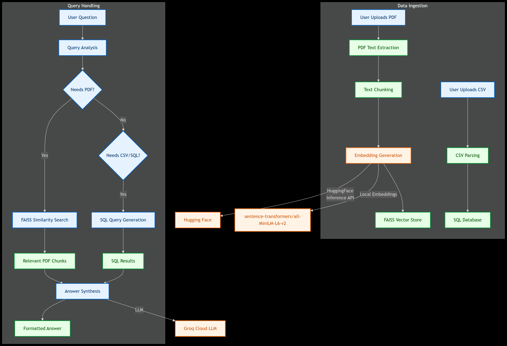
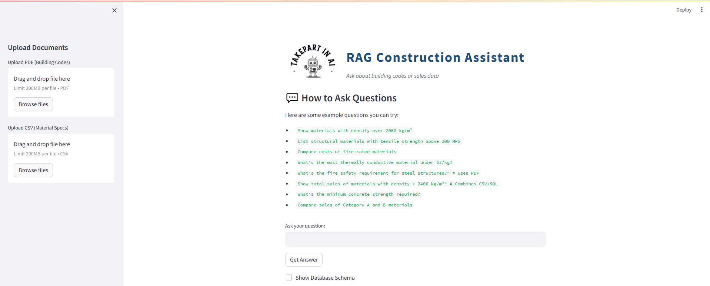
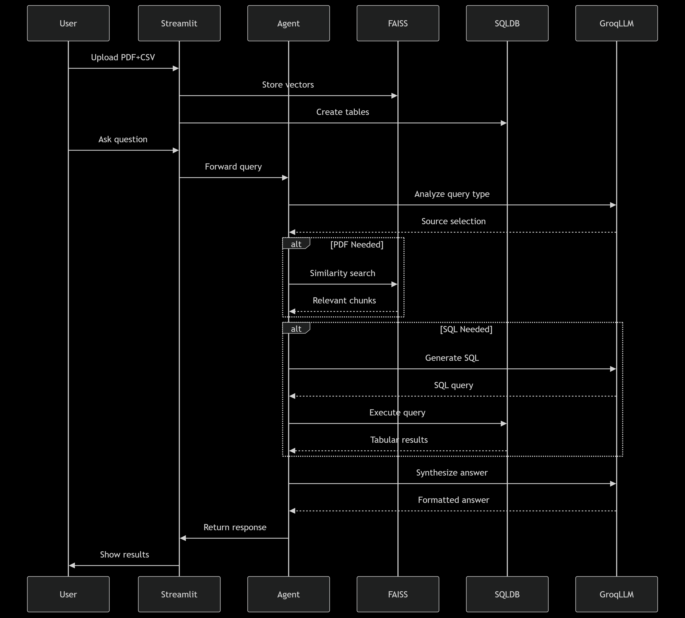

##  GenAI-Powered Text-to-SQL Application
## Overview
This project enables users to interact with databases using natural language queries.
An AI-powered assistant for construction professionals that combines building regulations (PDFs) and material specifications (CSV/SQL) using RAG architecture.

## High Level


## Key Features
- Multi-source RAG:
    - PDFs processed with FAISS vector search
    - CSVs loaded into SQL database
    - Original sales data maintained
- Intelligent Query Routing:
    - Uses Zero-shot ReAct agent
    - Automatically chooses between:
       - SQL queries for structured data
       - Vector search for building codes
       - Combined queries

## Technologies Used
- Backend: Python, SQLAlchemy
- Frontend: Streamlit
- Database: SQLite (or any other supported by SQLAlchemy)
- LLM Integration: Groq's ChatGroq class
- Embedding: Using LLM (OpenAI - text-embedding-3-small), To chunks text and store on FAISS vector database.
- Tokenizer: Hugging Face's transformers library for token counting

## Project - rag_text2sql - Construction Knowledge Assistant
This project talk Create an AI assistant for construction professionals that combines:
- Building Codes/Regulations (PDF documents)
- Material Specifications (CSV/SQL data)
- Sales/Order History (SQL database)




## Key Capabilities:
- Answer technical queries using PDF documents
- Analyze material properties from structured data
- Combine insights from both sources
- Handle complex questions like:
    - "What's the fire rating requirement for steel beams in high-rises, and show compliant materials under $50/kg?"*

## Features

- **Hybrid Knowledge Base**
  - PDF document processing (building codes, safety regulations)
  - CSV data integration (material specs, pricing)
  - SQL database for order history/analytics

- **Advanced Query Handling**
  - Natural language questions
  - Combined PDF+CSV queries
  - Automatic source routing

- **Tech Stack**
  - RAG Architecture
  - Groq API (Llama-70B) for reasoning
  - FAISS vector search
  - Streamlit frontend

## End-to-End Workflow with Example
## User Query:
  - "What's the minimum concrete strength for residential buildings, and show me materials in Category A?"

## Step 1: Query Analysis
```
# First LLM Call (Groq)
Agent thinks:
1. "Concrete strength" → Need PDF data
2. "Category A materials" → Need SQL data
```
## Step 2: Data Retrieval
```
# PDF Path:
docs = faiss_db.similarity_search("concrete strength residential")
→ Returns PDF chunks about concrete specs

# SQL Path:
query = "SELECT * FROM materials WHERE Category='A'"
result = sql_db.run(query)
→ Returns tabular data of Category A materials
```
## Step 3: Answer Synthesis
```
# Second LLM Call (Groq)
Prompt = f"""
PDF Context: {pdf_text}
SQL Data: {sql_results}
Question: {original_question}
Combine information into a natural answer.
"""
→ Final formatted answer with:
   - 30 MPa concrete requirement from PDF
   - List of Category A materials from CSV
```
## Data Flow Diagram




